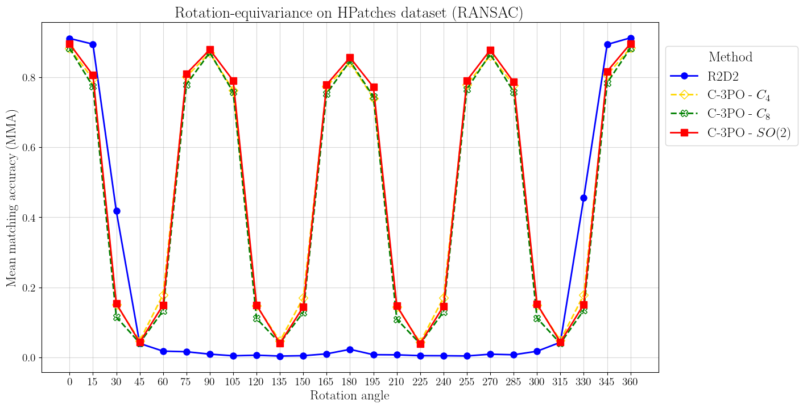

# C-3PO: Towards Rotation Equivariant Feature Detection and Description
Rotation equivariance meets local feature matching.


## Installation

First, clone the repo:
<!-- ```bash
git clone git@github.com:bpiyush/rotation-equivariant-lfm.git
``` -->
```bash
git clone https://github.com/bpiyush/rotation-equivariant-lfm.git
```

<!-- Next, follow steps in [here](./setup/README.md) to install the packages in a `conda` environment. -->

Next, follow the steps to create a `conda` environment.

```bash
sbatch jobscripts/create_gpu_env.sh
```
> Note: This has only been tested on the Lisa cluster. If you want to run the code on a CPU, please follow the instructions [here](./setup/README.md). Although, we recommend using the GPU version.

<!-- 
## Datasets

Follow steps in [here](./data/README.md) to download and prepare the datasets. A dataset summary table is provided below. -->


> Tip: To use the conda environment on the login node, you will need to run the following commands before activating the environment:

```bash
module purge
module load 2021
module load Anaconda3/2021.05
conda activate relfm-v1.0
```

You can check if the packages are installed correctly by running:
```bash
python setup/check_packages.py
```

Further, before running any code, please set the `PYTHONPATH` as follows:
```bash
# navigate to the directory where the code is located
cd /path/to/repo/
export PYTHONPATH=$PWD:$PWD/lib/r2d2/
```


## Pretrained models

We provide checkpoints to models trained on the Aachen dataset following R2D2. The key models are tabulated as follows:

| Model | Description | Checkpoint |
| --- | --- | --- |
| R2D2 | R2D2 baseline | [r2d2_WASF_N16.pt](./trained_models/r2d2_WASF_N16.pt) |
| C3 | Discrete group C3 model from C-3PO family |  [finalmodelC3_epoch_2_4x16_1x32_1x64_2x128.pt](trained_models/finalmodelC3_epoch_2_4x16_1x32_1x64_2x128.pt) |
| C4 | Discrete group C4 model from C-3PO family |  [finalmodelC4_epoch_5_4x16_1x32_1x64_2x128.pt](trained_models/finalmodelC4_epoch_5_4x16_1x32_1x64_2x128.pt) |
| C8 | Discrete group C8 model from C-3PO family |  [finalmodelC8_epoch_1_4x16_1x32_1x64_2x128.pt](trained_models/finalmodelC8_epoch_1_4x16_1x32_1x64_2x128.pt) |
| SO2 | Continuous group SO2 model from C-3PO family |  [finalmodelSO2_epoch_17_4x16_1x32_1x64_2x128.pt](trained_models/finalmodelSO2_epoch_17_4x16_1x32_1x64_2x128.pt) |

Note that the equivariant models are selected based on early stopping and in general, they converge faster than the non-equivariant models.

The performance across varying rotations is shown in the Figure below.
<!--  -->
<p align="center">
  
</p>


## Evaluation

In order to evaluate our pre-trained models on the [HPatches dataset](https://github.com/hpatches/hpatches-dataset), please follow these steps. For compactness, we provide steps for R2D2 and our SO(2) model. But the steps apply more generally. Note that since checkpoints are small, we provide them within the repo.

### 1. Download and setup the dataset
Download the dataset by:
```bash
mkdir -p $HOME/datasets/
cd $HOME/datasets/
wget http://icvl.ee.ic.ac.uk/vbalnt/hpatches/hpatches-sequences-release.tar.gz
tar -xvf hpatches-sequences-release.tar.gz
rm -rf hpatches-sequences-release.tar.gz
```
This shall create a folder `hpatches-sequences-release` in `$HOME/datasets/`.
Then, symlink it as a folder within the repo.
(Don't forget to set the path to repo correctly)
```bash
ln -s $HOME/datasets /path/to/repo/data
```

You can check out sample images from the dataset.
```bash
pip install ipython
```
```bash
(relfm-v1.0) $ ipython
```
```python
In [1]: %matplotlib inline
In [2]: from PIL import Image
In [3]: path = "~/datasets/hpatches-sequences-release/v_yard/1.ppm"
In [4]: img = Image.open(path)
In [5]: img.show() # this may not open on Lisa since it is not a GUI terminal
```

### 2. Run inference for each model

In this step, the model is ran on each sample in the dataset and the predictions are stored. We recommend running this step in Lisa since it takes a while.


First, run inference for R2D2 model.
```bash
sbatch jobscripts/inference_r2d2_on_hpatches.job 
```
This will run inference, generate outputs and save them to the folder:
`$HOME/outputs/rotation-equivariant-lfm/hpatches/r2d2_WASF_N16`. Depending on your checkpoint name, it will create a new folder for a new checkpoint.

The output shall have 1 folder per image sequence in HPatches, for e.g., `v_home`. Each folder shall contain the following files:

* `1_rotation_R.npy`: the predicted keypoint locations and descriptor vectors for the source image.
* `t_rotation_R.npy`: the predicted keypoint locations and descriptor vectors for the target image with index `t` and rotation `R`, $\forall t \in \{2, 3, 4, 5, 6\}, R \in \{0, 15, 30, .., 345, 360\}$.


Note that in the jobscript, we have set the default checkpoint path to the R2D2 checkpoint. To run inference for 
SO(2) model, change the `ckpt` variable in `jobscripts/inference_r2d2_on_hpatches.job` to `ckpt=trained_models/finalmodelSO2_epoch_17_4x16_1x32_1x64_2x128.pt`. Then, run
```bash
sbatch jobscripts/inference_r2d2_on_hpatches.job 
```
This should generate outputs in `$HOME/outputs/rotation-equivariant-lfm/hpatches/finalmodelSO2_epoch_17_4x16_1x32_1x64_2x128`.

This step takes about 20-25 mins per model.

### 3. Run evaluation to generate results

In this step, we use the predictions from the previous step to generate the results.

```bash
python relfm/eval/r2d2_on_hpatches.py --quantitative --models R2D2 "SO(2)"
```

In case you want to include the C4 variant, you can run the following command.
```bash
python relfm/eval/r2d2_on_hpatches.py --quantitative --models R2D2 "SO(2)" "C_{4}"
```

To generative qualitative results, you can run the following command.
```bash
python relfm/eval/r2d2_on_hpatches.py --qualitative --models R2D2 "SO(2)" --sequence_to_visualize i_castle --rotation_to_visualize 90
```
This will generate a figure at `./Figures/qual_results_rotation_i_castle_90.pdf`.

A sample qualitative result is shown in the Figure below.
<!-- 
 -->
 <!--  -->
<p align="center">
  
</p>
The first two columns show the detected keypoints and the last two columns show (correct) matches in green.

---

> Note: Our evaluation is partly based on the [notebook](https://github.com/mihaidusmanu/d2-net/blob/master/hpatches_sequences/HPatches-Sequences-Matching-Benchmark.ipynb) provided by [D2-Net](https://github.com/mihaidusmanu/d2-net). 


## Training

1. Activate the environment:
    ```bash
    # activate the environment
    conda activate relfm-v1.0

    # set the python path
    export PYTHONPATH=$PWD/lib/r2d2/:$PWD
    ```
2. Download [Aachen dataset](https://www.visuallocalization.net/datasets/): here, you can pass the path to the root data folder. For e.g, `$HOME/datasets/`.
    ```bash
    bash download_aachen.sh -d /path/to/root/data/folder/
    ```
    This will download all required datasets to `/path/to/root/data/folder/`. Note that we symlink this root data folder
    to `$PWD/data/` through the script, i.e., you can checkout data folder directly from `$PWD/data/`.
3. Note that the repo comes with R2D2 code in `lib/r2d2`. So no need to download the code.
4. Training R2D2: Run the following command:
    ```bash
    sbatch jobscripts/r2d2_training.job
    ```
    You can check the progress of your job via the slurm output file. You check job status via `squeue | grep $USER`.
    Note that this is only a sample run and will save a model at `/home/$USER/models/r2d2-sample/model.pt`. 


## Acknoledgements

We thank the authors of [R2D2](https://github.com/naver/r2d2), [D2-Net](https://dsmn.ml/publications/d2-net.html) papers for making their code publicly available. We thank our TA, [Miltos Kofinas](https://www.uva.nl/en/profile/k/o/m.kofinas/m.kofinas.html), for his guidance and the teaching staff for DL2.

<!-- ## Evaluation pipeline

To evaluate an R2D2-like model, we use the following evaluation steps:

### Generate and save predictions
Generate keypoint predictions for the HPatches dataset and save them to disk.
You need to pass the data director, base output folder and the model checkpoint path.
```sh
(relfm-1.0) $ python relfm/inference/r2d2_on_hpatches.py \
    --data_dir ./data/hpatches-sequences-release/ \
    --output_dir ~/outputs/rotation-equivariant-lfm/ \
    --model_ckpt_path ./checkpoints/r2d2_WASF_N16.pt \
    --num_keypoints 1000 
```
This will run inference, generate outputs and save them to the folder:
`$HOME/outputs/rotation-equivariant-lfm/hpatches/r2d2_WASF_N16`. Depending on your checkpoint name, it will create a new folder for a new checkpoint.

The output shall have 1 folder per image sequence in HPatches, for e.g., `v_home`. Each folder shall contain the following files:

* `1.npy`: the predicted keypoint locations and descriptor vectors for the source image.
* `t_rotation_R.npy`: the predicted keypoint locations and descriptor vectors for the target image with index `t` and rotation `R`, $\forall t \in \{2, 3, 4, 5, 6\}, R \in \{0, 15, 30, .., 345, 360\}$.

Tips:
* Please run the following to see all options:
    ```sh
    (relfm-1.0) $ python relfm/inference/r2d2_on_hpatches.py --help
    ```
* If you want to debug and run this script only for 1 image sequence, let's say, `v_home`, then run:
    ```sh
    (relfm-1.0) $ python relfm/inference/r2d2_on_hpatches.py \
        --data_dir ./data/hpatches-sequences-release/ \
        --output_dir ~/outputs/rotation-equivariant-lfm/ \
        --model_ckpt_path ./checkpoints/r2d2_WASF_N16.pt \
        --num_keypoints 1000 \
        --seq_prefix v_home \
        --debug
    ```

### Evaluate predictions
Use the generated predictions to evaluation robustness of feature matching to rotations. You can do this by running [this notebook](./notebooks/eval_on_hpatches.ipynb). -->